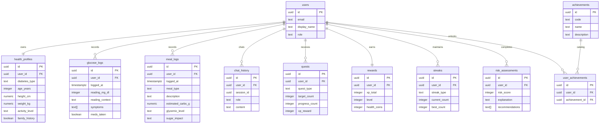

# GlycoBete Database Design

GlycoBete should use Supabase Postgres for Phase 1 because the product needs
relational health logs, secure auth, row-level security, migrations, and a clear
path to family-monitoring permissions.

## ER Diagram



## Migration

Run the Phase 1 migration from:

```bash
supabase db push
```

Migration file:

```text
supabase/migrations/001_glycobete_core_schema.sql
```

## Security Model

- Supabase Auth owns the canonical user identity through `auth.users`.
- Application user rows mirror auth users in `public.users`.
- Row-level security is enabled on all user-owned health tables.
- Authenticated users can only access records where `auth.uid() = user_id`.
- Global achievement catalog rows are readable by authenticated users.
- Future caregiver permissions should be added as a separate join table instead
  of sharing patient credentials.
